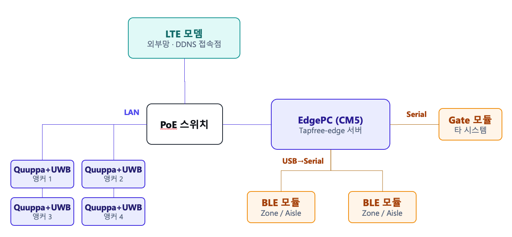

# 01. 하드웨어 배선

← [00. 전제 조건 확인](./00-prerequisites.md)

## 전체 구성도

- **PoE 스위치 1대** 가 네트워크의 중심. LTE 모뎀, EdgePC, 앵커박스 가 모두 이 스위치에 연결된다.
- 앵커 박스는 PoE 로 전원과 데이터를 함께 공급받는다.
- BLE 모듈 / Gate 모듈은 EdgePC 와 **Serial** 로 직접 연결된다 (PoE 스위치 경유 아님).

---

## 연결 항목

### 1) PoE 스위치 (네트워크 중심)

- 모든 포트가 PoE 지원이므로 **포트 구분 없이** 자유롭게 연결한다.
- LTE 모뎀, EdgePC, 앵커박스 가 모두 본 스위치에 연결된다.
- 전원: **전용 어댑터로 공급**

### 2) LTE 모뎀 ↔ PoE 스위치

- 연결: **LAN 케이블** — PoE 스위치의 임의 포트에 연결
- 목적: 외부망 진입점. EdgePC 가 본 모뎀을 통해 인터넷에 접속하여 DDNS 등록 및 모바일 클라이언트 수락.
- 전원: **전용 어댑터로 공급**

### 3) EdgePC ↔ PoE 스위치

- 연결: **LAN 케이블** — PoE 스위치의 임의 포트에 연결
- 목적: EdgePC 가 LTE 모뎀(외부망) 및 Quuppa 앵커(내부망) 와 동일 네트워크에서 통신.
- 전원: **전용 어댑터로 공급**

### 4) 앵커박스 ↔ PoE 스위치

- 연결: **LAN 케이블** — 각 앵커가 PoE 스위치의 임의 포트에 연결
- 목적: Quuppa 앵커가 EdgePC 의 Quuppa 서버로 위치 데이터 전송
- 전원: PoE 로 공급 (별도 전원 어댑터 불필요)

### 5) EdgePC ↔ BLE 모듈

- 연결: EdgePC 의 USB 포트에 직결. 내부적으로는 USB-to-Serial 로 인식된다.
- 목적: Zone / Aisle 식별용 BLE 광고 송출 제어

### 6) EdgePC ↔ Gate 모듈 (타 시스템)

- 연결: **Serial**
- 목적: 결제/통과 이벤트의 송수신

### 7) UWB 앵커

- UWB 앵커는 **Quuppa 앵커와 동일한 앵커 박스**에 함께 설치되어 있다.
- 전원은 PoE 로부터 Quuppa 앵커와 함께 공급되므로, **Quuppa 앵커 연결 시 자동으로 전원이 인가**된다.
- 별도 배선 작업이 필요 없다.

---

→ [02. LTE 모뎀 설정](./02-lte-modem.md)
