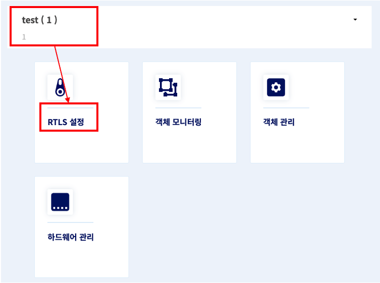
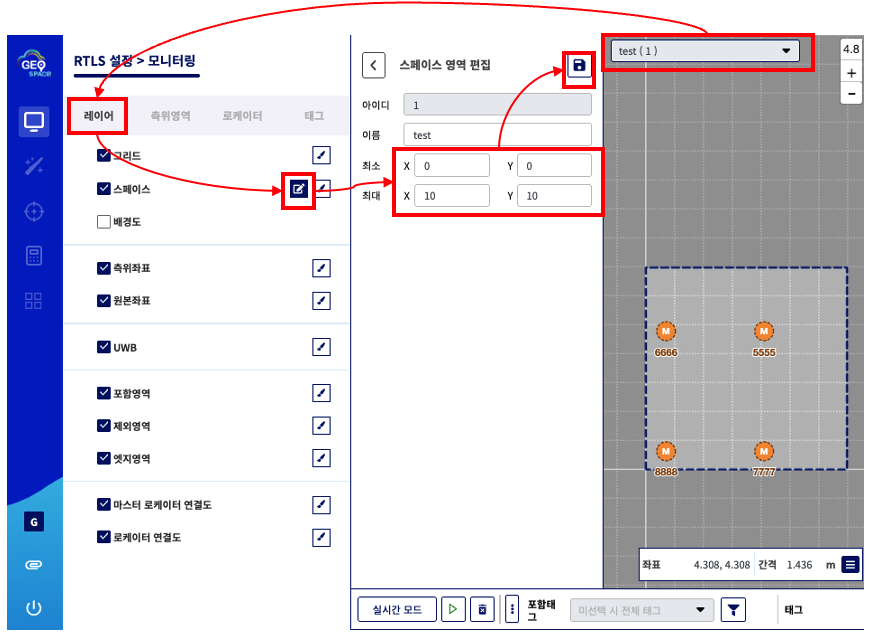
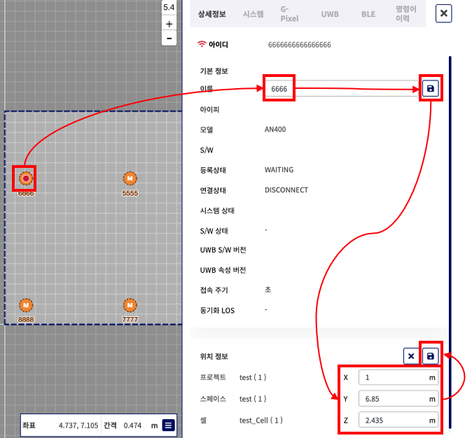

# 04. Geospace 앵커 설정

← [03. EdgePC TimeZone 설정](./03-edgepc-timezone.md)

기본 설치본에는 이미 앵커 4기가 등록되어 있다. 본 단계에서는 이 앵커들의 **이름과 위치를 현장값으로 수정**한다.

> **전제**: 본 단계는 앵커의 **물리적 설치 및 좌표 측정이 완료된 상태**에서 시작한다.

---

## 사전 준비물

- [ ] **앵커 좌표 목록** (현장 측량 완료) — 앵커 ID + 상대 좌표 (x, y, z)

---

## 1. Geospace 페이지 접속

1. 브라우저에서 Geospace 페이지 접속 — `https://{host}:8443/`
2. 계정 로그인 — `geoplan` / `wldhvmffos#123`

---

## 2. 앵커 이름 수정 및 위치 수정

1. **`test(1)` 프로젝트** (기본 프로젝트) 확인 후 **RTLS 설정** 으로 이동

2. 지도가 나타나면, 지도의 **좌측 상단** 에서 **`test(1)` 스페이스** (기본 스페이스) 가 선택되어 있는지 확인
3. 좌측 **레이어 탭** 의 **스페이스 영역 편집** 버튼 클릭
4. **최소 / 최대 값** 을 모든 앵커의 위치를 포함하도록 **넉넉히** 영역을 지정한 후 저장

5. 기본 앵커 4기가 이미 존재한다. 이 **4개 앵커의 이름** 을 **하드웨어에 기입된 UWB MAC** (4자리 HEX) 으로 변경
6. 각 앵커의 **위치 정보** 를 사전에 측정된 좌표값으로 변경

> **유의사항**
> - 본 단계 이후에도 **앵커는 Geospace 상에서 Online 상태가 되지 않는다.**
> - Geospace 에 입력하는 **앵커의 MAC 과 위치 정보** 는 단지 **Edge Server 가 사용할 데이터** 와 **배치의 시각적 가시성** 을 위해 보관되는 값이다.
> - **Geospace 와 실제 앵커 디바이스 간의 통신/상호작용은 없다.**
> - **현장에 설치된 4개 앵커 이외의 ID를 가진 앵커가 해당 스페이스에 존재해서는 안 된다. ** 좌측 **로케이터 탭** 에 **반드시 설치된 4개만** 존재하는지 확인하고, 그 외의 앵커가 있다면 삭제할 것.

---

## 완료 후 확인

- [ ] 4개 앵커의 이름이 모두 UWB MAC 으로 수정됨
- [ ] 각 앵커 좌표가 사전 측정값과 일치
- [ ] 시각화 뷰에서 앵커 위치가 합리적으로 표시됨

→ [05. PRM 게이트 / 영역 설정](./05-prm-gates-areas.md)
