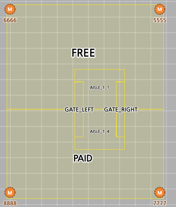

# 05. PRM 게이트 / 영역 설정

← [04. Geospace 앵커 설정](./04-geospace-anchors.md)

기본 설치본에는 이미 **성남 캠퍼스 기준의 영역들** 이 추가되어 있다.
본 단계에서는 이 영역들의 **위치(좌표)만 현장값으로 이동/수정** 하면 된다. 신규 영역 생성 작업은 필요하지 않다.

> **전제**: 본 단계는 게이트의 **물리적 설치 및 위치 좌표 측정이 완료된 상태**에서 시작한다.

---

## 사전 준비물

- [ ] **게이트 폴리곤 목록** (현장 측량 완료) — 모든 게이트의 폴리곤이 미리 계산되어 있어야 한다.
  - 한 게이트의 **한 꼭짓점 좌표** 를 기준점으로 측정
  - 게이트의 **가로 / 세로 길이**
  - **게이트 간 간격**
  - 위 세 가지 값을 조합하여 **모든 게이트의 네 꼭짓점 좌표(폴리곤)** 를 산출해 둔다.
- [ ] [04. Geospace 앵커 설정](./04-geospace-anchors.md) 완료 (좌표계 기준이 동일해야 함)

---

## 1. PRM 페이지 접속

1. 브라우저에서 PRM 페이지 접속 — `http://{host}:7081/prm/login`
2. 계정 로그인 — `admin` / `admin`
3. **`test` 프로젝트** (기본 프로젝트) 선택

---

## 2. 게이트 위치 수정

> **전제**: 본 단계 진입 전, 모든 게이트의 **폴리곤 좌표** 가 산출되어 있어야 한다. (사전 준비물 참조)

1. **진출입 영역 설정** 으로 이동
2. 이름이 `GATE_` 로 시작하는 영역들을 확인
3. 적당한 영역을 골라 측정된 **게이트 폴리곤 좌표대로 영역을 수정**

> **유의사항**
> - `GATE_*` 영역은 실제 진출입 영역을 그리기 위한 **reference** 및 **게이트 위치를 육안으로 확인** 하기 위한 용도이다.
> - **외부 연계** 를 반드시 **`N`** 으로 설정해야 한다.
> - 모바일에서는 본 영역의 진출입을 판단하지 않는다.

---

## 3. 영역 수정

작업 방식은 [2. 게이트 위치 수정](#2-게이트-위치-수정) 과 동일하며, 본 단계에서는 `FREE`, `PAID`, `AISLE_*` 영역을 편집한다.

### 편집 규칙

- **두 게이트와 그 사이의 내부 영역(통로)을 제외한 나머지 영역** 을 절반은 `FREE`, 절반은 `PAID` 로 설정한다.
- 이미 그려진 `GATE_*` 폴리곤을 reference 로 활용해 `FREE` / `PAID` 폴리곤을 완성한 후 저장.
- **AISLE 영역** 은 `GATE_*` 사이의 통로 영역을 절반으로 나누어:
  - `AISLE_1_1` → `FREE` 측에 위치
  - `AISLE_1_4` → `PAID` 측에 위치

---

## 4. 영역 설정 예시

아래 이미지는 설정 예시이며, 좌표 측정 결과에 따라 `FREE` / `PAID` 의 **위/아래 위치가 바뀌거나 가로·세로 배치로 변경** 될 수 있다.

방향이 어느 쪽이든 **`AISLE_1_1` 은 `FREE` 측, `AISLE_1_4` 는 `PAID` 측** 이라는 점은 변하지 않는다.

---

→ [06. iPhone 캘리브레이션](./06-iphone-calibration.md)
