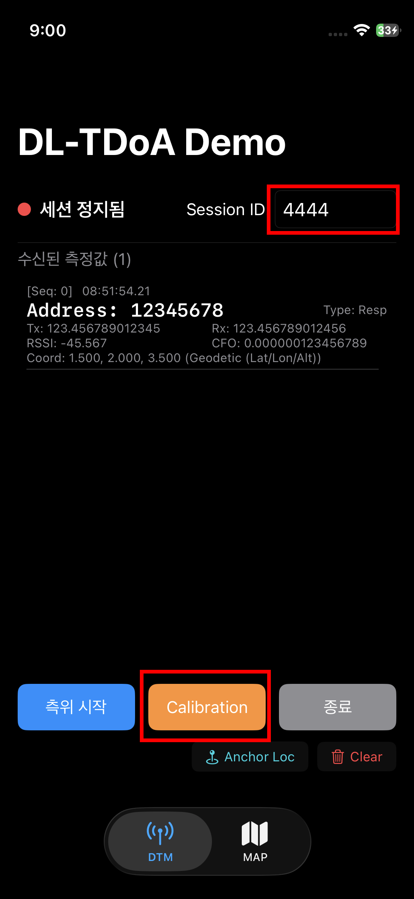
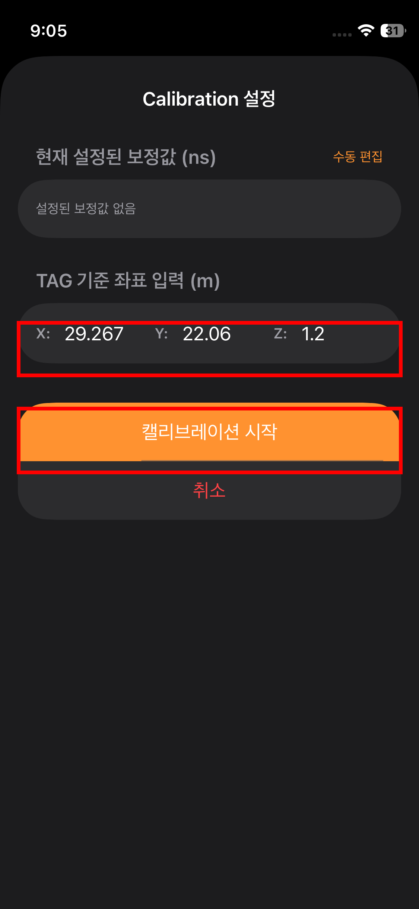
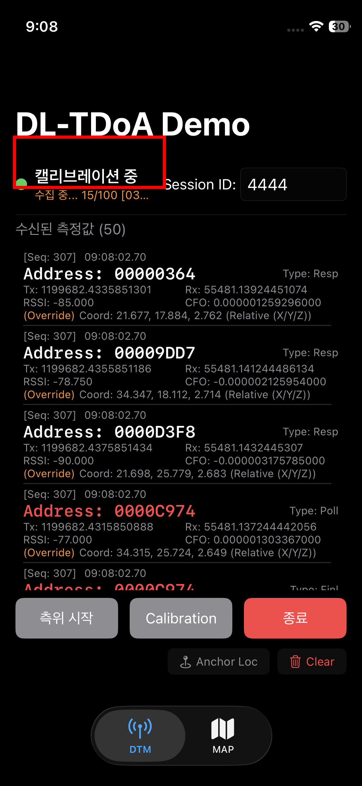
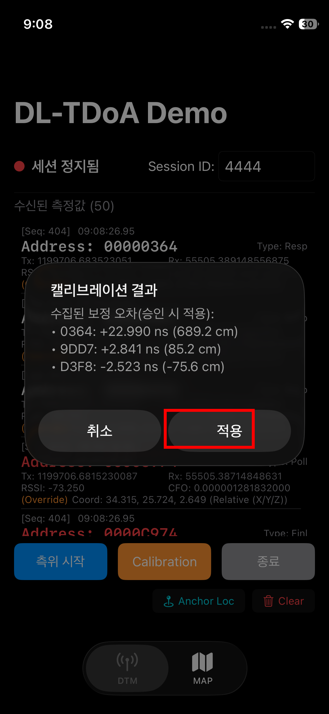
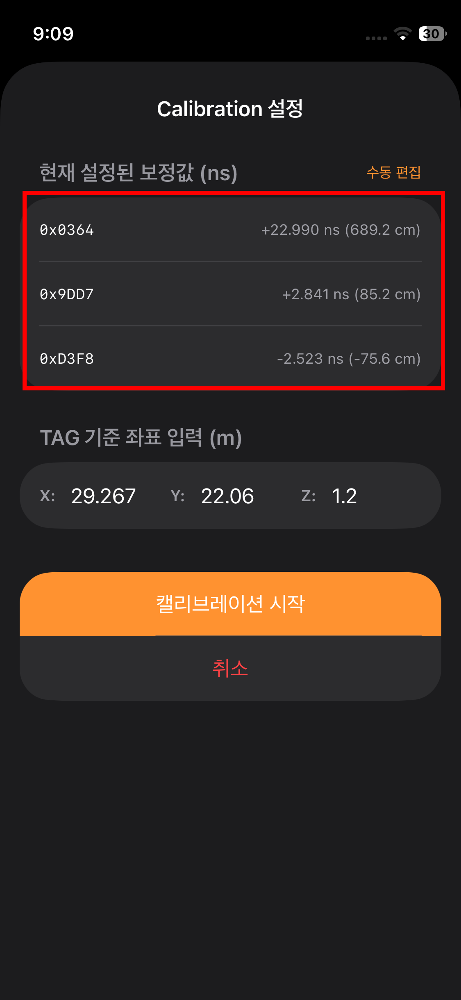
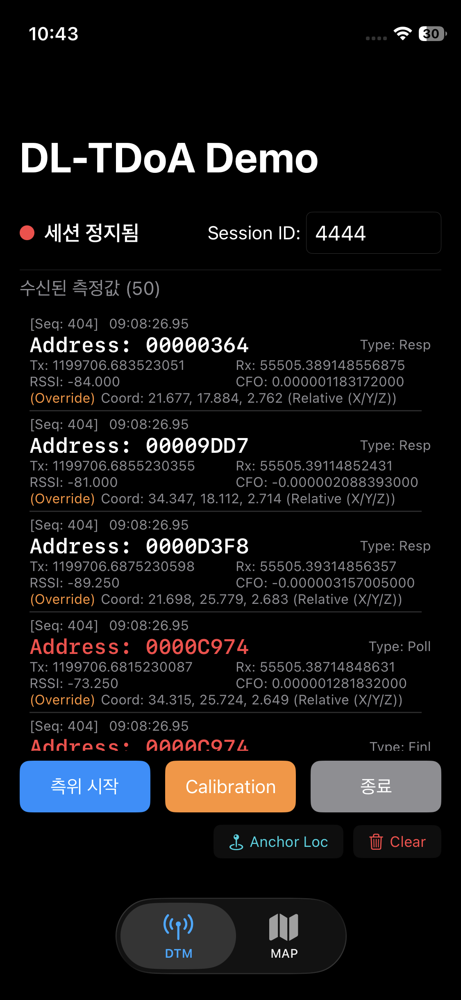
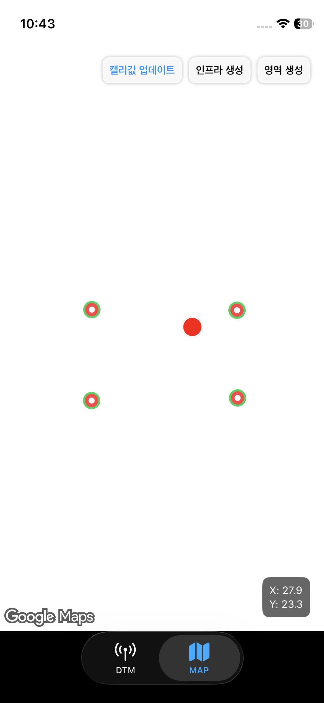

# 06. iPhone 캘리브레이션

← [05. PRM 게이트 / 영역 설정](./05-prm-gates-areas.md)

본 단계에서는 **캘리브레이션 전용 앱**으로 설치된 **앵커들의 시간차 보정값**을 산출한다.

산출된 보정값은 다음 단계인 [07. Tapfree-edge 설정](./07-tapfree-edge-config.md) 에서 사용되므로 **반드시 메모해 둔다.**

---

## 전제 조건

- **사전 측정된 캘리브레이션 위치 좌표** 가 확정되어 있어야 한다 ([00. 전제 조건 확인](./00-prerequisites.md#2-측정-정보) 참조).
- **Geoplan 에서 제공된 캘리브레이션 앱** 이 설치된 iPhone.
- **앵커의 Session ID** (앵커 수령 시 함께 안내됨)
- 다음 단계가 모두 완료된 상태:
  - [02. LTE 모뎀 설정](./02-lte-modem.md)
  - [04. Geospace 앵커 설정](./04-geospace-anchors.md)

## 작업 단계

### 1. 앵커 위치 동기화

> TBD — 앵커 위치 동기화 절차로 변경 예정. 작성 보류.

### 2. 캘리브레이션 시작

- Calibrator 앱 메인 화면의 **Session ID** 입력란에 앵커 수령 시 안내받은 값을 입력. (Calibration 설정 화면 진입 전 입력)
- 메인 화면에서 **Calibration** 버튼을 눌러 `Calibration 설정` 화면으로 진입.
- `Calibration 설정` 화면의 **TAG 기준 좌표 입력** 영역에 사전 측정된 **캘리브레이션 위치 좌표** 를 입력.
- 폰을 삼각대 위에 올린 채로 **캘리브레이션 시작** 버튼을 누른다.

  
  

### 3. 진행 및 결과 적용

- 캘리브레이션이 시작되면 메인 화면으로 이동, 수집 데이터가 **100/100** 될 때까지 자동 진행 (1분 이내 완료).
- 진행 중에는 모든 앵커와 폰 사이의 **LOS (Line of Sight)** 가 가리지 않도록 한다.
- 완료되면 `캘리브레이션 결과` 다이얼로그에 앵커별 보정 오차가 표시되며, **적용** 버튼을 눌러 반영.
- `Calibration 설정` 화면을 다시 열어 보면 **현재 설정된 보정값** 목록에서 앵커별 보정값을 확인할 수 있다.
- **MAC 별 ns 값(부호 포함)을 메모해 둔다.** [07. Tapfree-edge 설정](./07-tapfree-edge-config.md) 에서 그대로 입력해야 한다.

예시:

| MAC | 보정값 (ns) |
|---|---:|
| `0x0364` | `+22.990` |
| `0x9DD7` | `+2.841` |
| `0xD3F8` | `-2.523` |

> ⚠️ 위 값은 설명용 예시일 뿐 **실측값이 아니다.** 현장에서 직접 캘리브레이션해 얻은 값을 사용한다.

> ⓘ **Master 앵커** 의 보정값은 항상 `0` 이므로 목록에 표시되지 않는다.

  
  
  

### 4. 측위 좌표 확인

적용된 보정값으로 실제 측위가 정상적으로 이루어지는지 Calibrator 앱에서 확인한다.

- 메인 화면에서 **측위 시작** 버튼을 눌러 측위를 시작한다.
- 화면에 **측위 데이터가 수신** 되는지 확인.
- 하단 **Map 탭** 으로 이동. (배경 지도는 표시되지 않으며, 앵커의 위치를 기준으로만 좌표를 도출.)
- 폰을 들고 이동하면서 **좌표가 올바른 방향으로 따라 움직이는지** 확인.

  
  

---

→ [07. Tapfree-edge 설정 (zone_settings.json)](./07-tapfree-edge-config.md)
